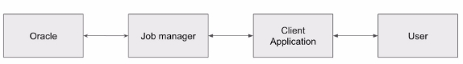
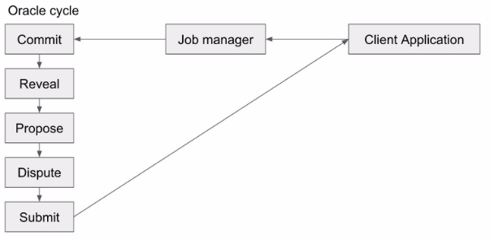
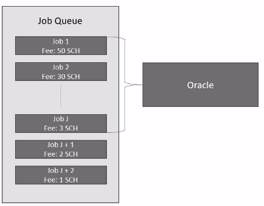
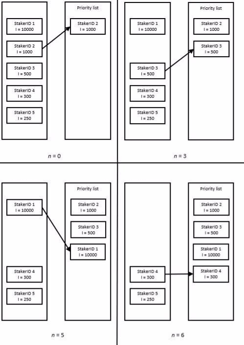

**Razor Network: A decentralized oracle platform**  

Hrishikesh Huilgolkar CEO, Razor network Revision: 22nd January 2021 Version 1.4 

## Abstract 
---

Decentralized technologies such as blockchain are revolutionizing many industries including finance. Applications such as decentralized lending, stable currencies, prediction markets, and synthetic assets are being researched and built on top of them. Many such applications depend on real-world data, which is not readily available inside the blockchain environment due to their design. Currently, this problem is being solved by something called an “Oracle”, which is an entity that reads real-world data and feeds it to the blockchain. Current  Oracle  solutions  are  either  centralized  or  vulnerable  to  certain attacks. Current oracle solutions may work short term but are not suitable for long term applications, which is essential in decentralized applications.  

In this paper, we propose a fully decentralized oracle network called "Razor network" with built-in governance, so that the network can thwart such attacks and remain functional in a constantly evolving environment. Razor network is resilient to bribing attacks since it utilizes a high degree of redundancy and offers high economic security for all applications regardless of the fees being paid to the oracle. Razor network also can dispute the results of the oracle, which makes it resistant to many kinds of game theoretical vulnerabilities. 

Razor network consists of stakers1 who accept queries from a job queue, perform
fetching of information from the real-world, process and aggregate the results and serve
them to the requesting application. Stakers are awarded for reporting coherently and
penalized for reporting incoherently.

Razor network uses a proof of stake consensus algorithm and uses a native utility token called RAZOR. RAZOR are needed to be locked to participate as a staker in the network. Stakers are awarded fees as well as block rewards for participating in the network. The amount of staked tokens of the staker determine their influence in the network.  

The design goals of the Razor network are to ensure the long term sustainability of the oracle and the data feeds it provides, a high degree of decentralization, high economic security in a way that protects both stakers and clients of the oracle from various attacks. 

 _1 Stakers are users who lock their funds in a smart contract. This action is known as “staking”. Stakers are expected to perform their duties honestly, or else they may lose their funds and future profits._

## Table of contents 
---

**1 Introduction** 

 - 1.1. Motivation 
 - 1.2. Previous work 
     - 1.2.1 Lack of high degree of decentralization and economic security 
     - 1.2.2 Lack of long term viability 
     - 1.2.3 Cognitive load on developers 
     - 1.2.4 Targeted misinformation and invalid source attacks
     - 1.2.5 Bribing and P+ε attacks 
 - 1.3 Design Goals 
     - 1.3.1 High economic security 
     - 1.3.2 High degree of decentralization 
     - 1.3.3 Protection of stakers from various attacks 
     - 1.3.4 Protection of clients from malicious stakers 
     - 1.3.5 Censorship resistance 
     - 1.3.6 Ease of use for application developers 
     - 1.3.7 Collusion and bribing attack resistance 
 - 1.4 Architectural overview 
     - 1.4.1 Oracle 
     - 1.4.2 Job manager 
     - 1.4.3 Client Application 
     - 1.4.4 User 

**2 Architecture** 

  - 2.1 RAZOR - Native token or Razor network 
     - 2.1.1 Utility of RAZOR 
     - 2.1.2 Supply Schedule 
  - 2.2 Actors 
  - 2.3 Oracle Layer 
     - 2.3.1 Epoch 
     - 2.3.2 States 
     - 2.3.3 Job queue 
     - 2.3.4 Actions 
         - 2.3.4.1 Stake 
         - 2.3.4.2 Commit 
         - 2.3.4.3 Reveal 
         - 2.3.4.4 Propose Block 
         - 2.3.4.5 Dispute Block 
         - 2.3.4.6 Unstake 
         - 2.3.4.7 Withdraw 
         - 2.3.4.8 Submit results 
         - 2.3.4.9 Submit job 
         - 2.3.4.10 Dispute Results 
  - 2.4 Dispute mechanism 
  - 2.5 Incentives and penalties 
     - 2.5.1 Penalties and rewards for reporting data 
     - 2.5.2 Block reward 
     - 2.5.3 Fees 
     - 2.5.4 Validity bond 
     - 2.5.5 Dispute bond 
     - 2.5.6 Penalties for misbehavior 
  - 2.6 Security 
     - 2.6.1 Economic security 
     - 2.6.2 Attacks
         - 2.6.2.1 Influence of large stakers 
         - 2.6.2.2 Takeover 
         - 2.6.2.3 Bribing
         - 2.6.2.4 Collusion 
         - 2.6.2.5 Griefing 
         - 2.6.2.6 Invalid source attack 
         - 2.6.2.7 Bribing attack 

**3 Governance**

  - 3.1 Voting 

**4 Scalability** 

**5 Applications** 

  - 5.1 Synthetic assets platform 

**6 Future work** 

  - 6.1 Scalability improvements 
  - 6.2 Improvements to the governance layer 

**7 Acknowledgments** 

## List of figures 

1. Architectural overview
1. Process flow in Razor network
1. Epochs and their overlap overlap
1. Selection of the jobs from the job
1. Merkle tree of commitments
1. Assignment of jobs to a staker
1. Selection for the block proposer list
                                                                                                                                                             

## 1 Introduction
--- 

### 1.1 Motivation 

Decentralized  networks,  through  the  use  of  smart  contracts,  are  disrupting established systems by removing the need for intermediaries and providing open access to everyone. Decentralized Finance is one of the most promising use cases of smart contracts. Some of the examples of Decentralized Finance (also known as DeFi)  applications include: 

1. Decentralized stable currencies, also known as “Stablecoins” 
1. Decentralized Insurance 
1. Decentralized Prediction markets 
1. Decentralized Synthetic assets 
1. Decentralized exchanges and derivatives trading market 
1. Decentralized Identity 

These applications consists of a set of smart contracts deployed on a blockchain platform.  Such  applications  often  require  data  from  outside  the  confinements  of  the blockchains they reside in. Blockchains, being a deterministic system, only depend on the information  available  inside  the  system,  as  that  is  the  only  information  that  can  be cryptographically verified by all participants anytime. Blockchains do not readily have access to the outside world, by design. 

Hence, to facilitate the access to the outside world, the concept of "Oracles" has been proposed. An Oracle is an entity which queries the required data from the outside world and feeds it to the blockchain. Traditionally, this has been attempted through the use of trusted intermediaries. This is typically facilitated by accessing a data feed through an API or a webpage, validating it through multiple sources and feeding it to the blockchain. These intermediaries  are  centralized  entities  and  hence,  introduce  single  points of failure in a decentralized system. Such weaknesses are not desirable because they reduce the utility and security of a decentralized system to that of a centralized, trusted one. 

To combat this weakness, the concept of a decentralized oracle was introduced.
In this paper, we propose a general-purpose, resilient, decentralized and trustless2 Oracle platform, which addresses various shortfalls in the current designs.

_2 Trustless here means that no trusted third party or intermediaries are needed_

### 1.2 Previous work

Previous attempts to solve this problem include application-specific oracles such as Augur,  gnosis,  MakerDao,  centralized  oracles  such  as  Provable  and  general-purpose decentralized  oracle platforms such as Truthcoin, SchellingCoin, Chainlink, Band, Kleros and Witnet. The current work is inspired by SchellingCoin protocols such as Kleros and Augur. 

Developing a decentralized oracle is deemed a challenging problem. This is due to the possibility of multiple kinds of attacks such as collusion, takeover, griefing, bribing, etc., the requirement of subjective and objective decision making, determining the "truth", and also  due  to  the  technological  limitations  of  the  underlying  blockchain  protocol.  Current general-purpose oracle platforms face the following issues: 

1. Lack of a high degree of decentralization and economic security 
2. Lack of long term viability 
2. Cognitive load on application developers 
2. Targeted misinformation attacks 
2. Bribing and P+ε attacks
 
**1.2.1 Lack of high degree of decentralization and economic security** 

Some of the current solutions involve a trusted centralized mediatory, which acts as a single point of failure, while others combine results from a few stakeholders of the network. Often, if a high degree of decentralization is desired, the client has to pay a high amount of fees proportional to the degree of decentralization desired. This means that the accuracy and economic security of the oracle platform is not the same for all jobs, and the oracle cannot be trusted as the “Universal source of truth”. 

Let’s explore this problem with an example. Assume there is a CDP3 backed stablecoin project called “Acme". Acme platform issues US Dollar-pegged stablecoins backed by ether on the Ethereum blockchain, and hence, requires a data-feed of ether/USD. Acme depends on a decentralized oracle platform called "Truthbox". Truthbox assigns stakers to the query and reports the ether/USD price, every time Acme requests the data with a fee. The number of stakers assigned by Truthbox depends on the amount of fees being paid by Acme.

_3 CDP means Collateralized Debt Position_

This shows the weakness of the system. If someone requests to report the price to Acme with a very low fee, Truthbox will likely assign the task to a single staker (or very few stakers).  Hence  the  system  reduces  to  a  centralized  or  semi-centralized  oracle.  The protocol, in such cases, becomes vulnerable to various attacks such as griefing, bribing and collusion.  

If the oracle reports a price which is too far from the actual price, it can cause a large amount of liquidations and instability of the entire Acme platform. Hence it is required for Acme to pay a large amount of fees every time it requests a price from Truthbox, to make sure there is sufficient decentralization and economic security. But it still leaves it open to attacks  where  the  attacker pays an insignificant amount of fees to report an inaccurate datapoint to Acme. 

**1.2.2 Lack of long term viability** 

Many of the current general-purpose oracle platforms are not suitable for long term applications. They are based on the assumption that the data source is trustworthy and will not  be compromised. In case the data source is compromised or becomes defunct, the oracle service becomes dysfunctional.  

Some oracle platforms such as Chainlink are marketplace based, where a decision needs to be made to select oracle providers with higher reputation every time a data point needs to be fetched because the set of oracle providers and their reputation is constantly changing. 

Choosing the data feed and the oracle providers requires constant verification and decision making. This decision making cannot be made by a smart contract autonomously and requires decisions to be made by the stakeholders of the application. And hence, due to the constantly changing nature of the world outside blockchain, the current oracle solutions are not viable for long term applications. 

**1.2.3 Cognitive load on developers** 

As we discussed in the above section, the burden of balancing between fees and economic security falls on the shoulders of the clients or the application developers. In some platforms, developers are given the flexibility of choosing incentivization and punishment mechanism, aggregation method, etc. While this is desirable in some applications, incorrect decision making by the application developers can cause serious issues.  

**1.2.4 Targeted misinformation and invalid source attacks** 

Oracle platforms are vulnerable to targeted misinformation attacks. In this attack, the attacker asks the oracle to report value from a URL she directly controls. She can then program the website to report different data on each request. The attacker may even choose to report different values to 5% or 10% of the requests. 

Since most decentralized oracle providers use Truth-by-Consensus algorithms, this can  cause  reputational  or  financial  loss  to  the  stakers  even  though  they  were  acting honestly.

**1.2.5 Bribing and P+ε attacks** 

Stakers may be bribed by the attacker to report incorrect values. P+ε is an even stronger form of bribing attack where the attacker only signals the bribe and does not end up paying any bribe. This kind of attack can be especially devastating to oracles since it bears no cost to the attacker. 

### 1.3 Design Goals 

Design decisions have been made with the following goals in mind: 

1. High Economic security 
1. High degree of decentralization  
1. Protection of stakers from various kinds of attacks 
1. Protection of clients4 from malicious stakers
1. Censorship resistance 
1. Ease of use for developers 
1. Collusion and Bribing attack resistance

_4 Here, clients are entities who are requesting data-points from Razor oracle_

 
**1.3.1 High economic security** 

Economic  security  is  simply  the  amount  of  financial  resources  required  to compromise a network. Any decentralized network can be compromised with high enough financial resources. However, if the financial benefits of compromise are less than the cost, it is unprofitable to attack the network, hence unlikely that anyone will attempt to do so. 

Providing high economic security is one of the biggest design goals for this protocol. There is a clear need for an oracle protocol that provides this feature. Providing high and calculable  economic  security  provides  guarantees  for  applications  to  be  secure  until  a certain degree of economic value. 

Razor  provides  the same economic security to all requests (in the same type of requests - manual or automated) regardless of the fees being paid.  

Do note that if the results are disputed, the economic security provided is higher in the dispute round, since more stake is involved in the dispute phase. If the dispute rounds are also disputed, the economic security doubles in every dispute round. 

More details are provided in 2.6.1 

**1.3.2 High degree of decentralization** 

Blockchain  is  sometimes  referred  to  as  a  "trust machine". This is because blockchain removes  the  need  for  trusted  intermediaries  and  allows  a  platform  to  do  peer  to peer transactions without counterparty risk. Many decentralized applications are taking advantage of this property to build decentralized financial applications.

It is essential to for oracle platforms to have a high degree of decentralization. This means that to compromise the network, a large amount of entities need to be compromised. 

To  achieve  this,  Razor  uses  a  proof  of stake network where a large number of individual stakers can participate. Razor acts as an abstraction layer between clients and stakers so that any stakers can join and leave the network without having any effect on the client applications. Game theoretical and cryptographic measures such as commit-reveal scheme provides further collusion and censorship resistance.  

**1.3.3 Protection of stakers from various attacks** 

The  dispute  resolution  system  in  Razor  protects  honest  stakers  from  selective misinformation and collusion attacks.  

**1.3.4 Protection of clients from malicious stakers** 

A proof of stake consensus protocol is used in Razor to punish malicious stakers. This protects the clients from malicious stakers who may try to report incorrect or inaccurate data points to influence the result.

**1.3.5 Censorship resistance** 

A censorship attack is one where the actions of users, such as stakers and clients, are censored maliciously to achieve desired results. Layer-2 scalability solutions such as Plasma lack censorship resistance since the operators can censor any transaction. If such an attack occurs, it may cause temporary disruption to the applications relying on them. 

Due to these reasons, we have decided to use a proof of stake chain with Honey Badger  BFT  as  a  consensus  algorithm.  The  chain  will  be  Ethereum  Virtual  Machine compatible. 

**1.3.6 Ease of use for application developers** 

In  the  Razor  platform,  decisions  such  as  choosing  the  level  of  economic  security, aggregation function, selecting stakers, etc. have been abstracted away for the benefit of developers. Developers can easily and safely use integrate Razor platform without knowing the underlying architecture. 

**1.3.7 Collusion and bribing attack resistance** 

Due to the layered design and possibility of disputing results, the Razor network is resistant to such attacks. Collusion and bribing may be possible at one round of the oracle, but such results will likely be disputed and will be overturned in the dispute rounds. 

### 1.4 Architectural overview

Razor network consists of 4 parts: 

1. Oracle 
1. Job manager 
1. Client application 
1. User 

*Figure 1: Architectural overview*  

**1.4.1 Oracle** 

The oracle consists of stakers who process queries in the job queue and provide the result to the client application as requested. 

Stakers must deposit their RAZOR to become a staker in the oracle platform. They process  top  jobs  in  job  queue  in  batches  of  ***J***.  The  stakers  query  the data source as mentioned in the job specifications and perform required data processing operations on it before submitting it to the oracle contract. Aggregation is then performed before reporting the finalized value to the requested contract. 

The  validation  cycle  is  automatic  and  hence  the  validation  client can be run by stakers with virtually no manual actions required. However, Some jobs can be manual and will require manual reporting by the stakers. Also if a result is disputed, the dispute rounds will be manual. 

**1.4.2 Job manager** 

The job manager accepts queries from client applications and organizes them in the priority of the fees paid. The queries with higher fees will be prioritized to be processed by the oracle. The job manager supports single requests as well as data feed requests. 

**1.4.3 Client Application** 

This  is  an  application  using  the  oracle.  Razor,  being  a  general-purpose  oracle platform, is permissionless. Hence, any smart contract application, or user, can pay the fees to use the oracle's service.  

**1.4.4 User**

This is any user using the client application. The user may not even know that the Razor network is being used in the background for fetching data. 

## 2 Architecture 

The Razor network consists of 3 layers: 

1. Oracle layer 
1. Job manager 
1. Client application 

*Figure 2: Process flow in Razor network* 

### 2.1 RAZOR - Native token or Razor network 

Razor network will have a native ***utility*** token called “RAZOR”. RAZOR are ERC20 tokens on the Ethereum main net. These are necessary to perform a variety of activities in the Razor network. There will be an initial supply of RAZOR and the rest will be minted and distributed to stakers as block rewards. 

**2.1.1 Utility of RAZOR** 

RAZOR are necessary to perform the following activities in Razor: 

1. Staking 
1. Changing the parameters of the protocol through the governance mechanism 

**2.1.2 Supply Schedule** 

The block rewards will be high at the genesis to encourage staker participation and will slowly decrease over time. More details about the supply schedule will be discussed in a separate paper. 

### 2.2 Actors
 
1. Stakers 
1. Clients 

Stakers are the users who stake their RAZOR to participate in processing jobs and reporting results to the network. In return, they get rewarded through block rewards and fees paid by clients. 

Clients are users who use the services of the platform to get the values of various data points by paying the fees. 

### 2.3 Oracle Layer 

RAZOR can be locked in a smart contract by users called "Stakers". RAZOR must be staked on Razor platform to perform various actions and generate rewards. Stakers are rewarded, to be honest, and report values in consensus with the majority of stakers. The datapoint reported with majority consensus will be regarded as the “truth” adherent to the “Truth by consensus” approach. Acting dishonestly may cause loss of stake. 

There are two ways to use the oracle: 

1. Using an automated round 
1. Using a manual round 

The automated round is fast (can take less than a minute) while the manual round can take a day or more, depending on the responsiveness of the stakers. 

In the automated round, the stakers fetch the URL and report the results to the smart contract in an automated fashion. Since the URL can be malicious, the exposure of the stakers to each query is limited to limit the potential loss. If the result is not satisfactory, it can be disputed. 

The manual rounds require more fees compared to the automated round and are answered manually by the stakers. It can take a few days or more to resolve a manual round. The manual rounds can also be disputed. 

Since the dispute rounds can take a long time to resolve, the applications may cancel the transaction at the application layer. The dispute rounds will, however, continue at the oracle layer. 

Stakers in the Razor platform can perform the following tasks: 

1. Process the selected queries in the job queue by querying the mentioned source and processing it before reporting it to the oracle contract. 
1. Reveal the secret and desired data-points 
1. Propose a block if elected as a block proposer 
1. Dispute blocks, if found invalid 
1. Submit the results to the client smart contract, once finalized 

All of these tasks can be performed automatically by the Razor client. In manual and dispute rounds, the querying of the data source and the verification of the data needs to be done manually by the stakers. 

**2.3.1 Epoch** 

One cycle of the oracle is called an "epoch". Each epoch is divided into 5 stages of equal periods.

*Figure 3: Epochs and their overlap* 

To make the protocol more efficient, there may be multiple epochs active at any point 

in time.  

**2.3.2 States** 

The Razor oracle has two States: 

1. Commit  
1. Reveal 

During ***Commit*** state, following actions can be performed: Stake, Commit results, Unstake, Withdraw, Propose block for the epoch (e - 1), submit block for the epoch (e - 2) 

During ***Reveal*** state, the following actions can be performed: Reveal results, Dispute block proposed in epoch (e - 1) 

Here, e is the current epoch. 

Do note that there can be up to 3 epochs running simultaneously in different stages, but they are in the same state as can be seen in Figure 2. 

**2.3.3 Job queue** 

*Figure 4: Selection of jobs from the job queue* 

The job queue consists of a list of queries that need to be processed by the oracle. The job queue is sorted by the amount of fees being paid. In every epoch, at most J jobs will be selected and processed by the stakers.  

*J*  = *SN* × *L* / (*R*)

Where, 

*SN* is the total number of active stakers 

R is the Redundancy factor and determines how many stakers will report the value for each job 

L is the Load factor,  defined by the number of jobs to be processed by each staker The governance layer will be able to make changes to the value of R and L as necessary, which, in turn, decide the value of J.  

Each job should have the following information: 

1. URL 
1. XHTML / JSON / Regex selector 

In addition to the fees being paid to the oracle, a validity bond must be paid. The validity bond incentivizes the client to provide a valid and reliable source. The validity bond will be calculated to be equal to the maximum potential loss incurred by stakers due to an invalid source URL. 

The client should make sure the data source follows the following guidelines to make sure their data source is not ruled as invalid: 

The data source should: 

1. Be reputable and well known  
1. Should handle heavy load 
1. Should respond reasonably fast 
1. Should not respond or behave in a byzantine manner 
1. Responses should not be too big  
1. It should be freely accessible and should not require a login, proxy client, etc.

 
**2.3.4 Actions** 

The following actions can be performed only by the stakers: Commit, Reveal, Propose, Submit, Unstake, Withdraw. 

Following actions can be performed by anyone: Dispute, Submit Job, Stake. 

**2.3.4.1. Stake** 

Staking involves locking ones “RAZOR” in the Razor oracle smart contract. Staking is required  to  process  jobs  and  propose  blocks  in  the  Razor  oracle  platform.  Users  are incentivized to become a staker because they get a chance to earn newly minted RAZOR called “block reward” in every epoch. They also earn the transaction fees paid by clients. However,  staking  also  comes  with  a  responsibility to keep the staking node active and behave honestly, or else penalties may be charged.  

Staking can only be done during **the Commit** state. A minimum of *Tmin* RAZOR must be staked to become a staker. If at any point in time, a staker’s stake drops below *Tmin*, she will not be able to participate in the network. Stakers are subject to lock-in periods and will not be able to withdraw before it expires. 

There is no upper limit on the maximum number of stakers. However, only a certain amount of stakers,  *Swinners* will be selected to participate in each epoch by a lottery. The chance of getting selected in each epoch is proportional to the stake of the staker. 

A staker is selected to participate in the epoch if the following statement is true: 

*PRN* < *Si* / (*Sm*× *D*)

Where, 

*PRN* is a deterministic and verifiable Pseudo-Random Number generated by each staker 

*Si* is the stake of ith staker 

*Sm* is the stake of the staker with most stake
*D* is the difficulty 

Here, the difficulty D is adjusted each epoch so the selected number of participants *Swinners* is equal to the desired value. If it is above the desired value, D will be reduced by 5% and vice versa.It is necessary to limit the number of active stakers each epoch in the network to avoid scalability issues, hence *Swinners* should be set carefully by the governance layer to limit the maximum number of stakers in the network. 

Only the stakers selected in this lottery will be able to participate in that epoch. 

**2.3.4.2 Commit** 

If jobs are pending in the job queue, stakers process them and submit the final data point. As Ethereum is a public blockchain, everyone can see everyone else's data points. This can cause various issues such as stakers piggybacking other stakers by copying their data  points, trustless on-chain bribing attacks, influencing small staker's results by large stakers, etc.  

Hence, we will be using a cryptographic commit-reveal scheme to keep the stakers' results secret. The stakers selected by the lottery process described in 2.3.4.1 will be able to participate in this action. They must process all of the J jobs to be processed in this epoch,
from the job queue and form a data structure called Merkle tree. The stakers then combine
the root of the Merkle tree5 with a secret salt before hashing it. This hash is the “commitment” of the staker to the results she arrived at.

_5 Merkle tree is a tree in which every leaf node is labeled with the hash of a data block, and every non-leaf node is labeled with the cryptographic hash of the labels of its child nodes._

Please note that the stakers process and commit all of the J jobs. But they will only reveal the values they are assigned to, in the reveal state. The jobs assigned to a staker are only revealed at the beginning of the reveal state, hence they must process and commit all of the J jobs honestly. 

The stakers are heavily disincentivized to reveal their results by revealing their secret because  if  anyone  reveals  their  secret  in  the  commit  state, the stakers will face harsh penalties. 

Commit action can only be performed during **Commit** state. At the beginning of this state, J jobs from the job queue are selected based on fees. All the stakers must process these jobs. In case a staker doesn’t perform this action, she will be penalized. Stakers must form a Merkle tree as shown below: 

*Figure 5: Merkle tree of commitments* 

A Merkle tree is a binary tree. Each of the nodes are labeled by the hash of its children and the leaves are labeled by the hashes of (jobId || data-point value) 

In the above figure we are assuming that we are processing 4 jobs (assuming J = 4). Every staker would need to process 4 jobs and would have arrived at 4 data-points. 

Every staker must submit the following value to the oracle smart contract: 

*C*  = *H*(*e* || *R* || *S*)

Here, 

*C* = Commitment 

*H*  =  Collision  Resistant  cryptographic  one  way Hash Function. We will be using keccak256 

*e* = epoch 

*R* = Merkle Root 

*S* = secret, a 32 bytes randomly generated salt  

Stakers must locally generate and save this salt carefully, as it is required to reveal the results in reveal stage. Also, if the secret is stolen and revealed by someone else, harsh penalties will apply. 

To  reduce  the  chances  of losing salt, the following function can be used by the stakers to generate deterministic salts: 

*S*  = *Sign*(*e*, *Sk*)

Where *Sk* is the secret key (also known as the private key) of the staker. 

**2.3.4.3 Reveal** 

This is the second stage of the reporting process. Stakers are supposed to reveal the secret they used in the Commit stage as well as the results of the job assigned to them, along with the Merkle proof proving that the submitted values are part of the commitment. This action can normally be performed in **the Reveal** state. However, anyone can call this function to submit another staker’s secret in **Commit** state to earn bounty and penalize that staker for revealing their secret. 

Every staker will be assigned a job pseudorandomly as follows: 

1. A pseudo-random number will be generated using the following salt: 

*PRN* = PRNG(*n* || *Bc* || *StakerId* )

Where,  

*PRN* = Pseudo-Random Number 

*PRNG* = Pseudo-random number generator generates a number between 0 and 1

*n*= nonce

*Bc* = block hash of the last block of the commit state 

2. The following equation will be evaluated to determine which jobs are assigned to the staker 

*nth* Job will be assigned to the staker if the following condition is satisfied: 

*n / (J)*  <  *PRN*  ≤  *n*+1 / (*J*)

Here, 

*n* = job ordered *nth*from the top of the list

*PRN* = Pseudo-Random Number generated in earlier step 

*J* = total number of jobs to be processed this epoch 

E.g. Let's assume J = 4. A staker generates PRN and performs the following comparisons to evaluate which job is assigned to her. 

if 0 ≤PRNG <  1/4, the first job is assigned

if  1/4 ≤ PRNG <  1/2, the second job is assigned, and so on. 

*Figure 6: Assignment of jobs to a staker* 

The above steps are repeated L times (where L is the load factor defined in 2.3.3 with incrementing nonces n = 1,2,3 …. L to determine which jobs are assigned to a staker. If the staker does not reveal during reveal state, she will be penalized. 

The staker must prove that she is only reporting the jobs as assigned to her, she is reporting all the jobs assigned to her and that she is reporting the committed values without changing them. The staker must also provide the leaf or node hashes to reconstruct the Merkle tree. 

As an example, let's assume J = 4 and jobs  *J*1 and  *J*4 are assigned to a staker. She must call the Commit action with the following parameters: 

*Commit* (*e*, *S*, *J1*, *R1*, *J4*, *R4*, *L2*, *L3*) 

Where, 

*e* is the current epoch 

*S* is the secret used in commit state 

*J1* is the job ID of job 1 

*R1* is the result of job 1 as committed by the staker

*L2* is the hash of leaf 2 

From  Figure  5,  you  can  see  that  this  much  information  is  sufficient  to  partially reconstruct the Merkle tree and derive the Merkle root. The Merkle root and the secret will be used to reconstruct the commitment and it will be verified against the commitment made by the staker. 

**2.3.4.4 Propose Block** 

During the propose state, any staker can propose a block, provided their current staked  amount  is  above  the  minimum  stake  required.  A  sorted  list  of  stakers  is pseudorandomly but deterministically calculable for each epoch. The probability of being higher up the list is directly proportional to the stake of each staker. The staker on top of this list gets the highest priority to propose a block. In case this staker does not propose a block or proposes an invalid block, block from the second proposer on this list will be selected and so on. In case there are no valid blocks proposed, the epoch will end without a block and the jobs will be processed in the next epoch. 

The following algorithm is used to prepare the block proposer priority list: 

1. First, we will select a staker pseudorandomly by virtually rolling a  *N* sided fair die. This can be calculated programmatically as:  

*Si* = ⌊*PRNG*(*n* || *BR*) ∗ *N*⌋ 

Where, 

*Si* = Staker ID 

*PRNG*  = Pseudo-Random Number Generator function which utilizes provided salt *n* = nonce 

*n* = nonce

*BR* = block hash of the last block of reveal state of current epoch

*N* = Number of stakers 

2. Then we will evaluate the following equation: 

*S* / (*SM*)  ≤  *PRNG*(*n* || *Si*  || *BR*  )

_Each block in blockchains such as Ethereum has a hash. This hash is virtually random and depends on the contents of the block and hash of the previous block._

Where, 

*S* = Stake of the staker 

*SM* = Stake of the staker with the highest Stake 

The above steps are repeated with increasing nonce (*n=*1,2,3,4,...*)* and whenever the second statement is evaluated to be true, that staker *Si* is added to the end of the block proposers list. Stakers who are already on the list are skipped. 

*Figure 7: Selection for the block proposer list* 

To propose, the staker must call the following function in the smart contract: 

*Propose*(*e*, *n*, *SMS* , *M1* , *M2* , *M3* , ..., *MJ*) 

Here,  

` `e = current epoch number 

` `n = nonce 

*MJ* = Median for job J 

*SMS*  = Staker ID of the staker with maximum stake 

A  valid  proposal  with  the  lowest nonce and  *SMS* with  the  highest  stake will be selected  as  a  block.  Even though the value of  *SMS* is available in the smart contract, calculating it will require iterating through all the stakers. Hence to overcome the technical challenge, it is instead proposed by the stakers.  

Since all the values to be submitted by the stakers are deterministic from the data available inside the blockchain, there should be no reason for miscalculations and deviation of the values from the true values. Hence harsh penalties will be applied if an invalid block is proposed. 

If a block is proven invalid during the dispute state, the next block in the queue will be selected as a candidate block to be finalized. And the process can repeat.  

**2.3.4.5 Dispute Block** 

If an invalid block is found, anyone can dispute it by performing on-chain aggregation calculation of the disputed job. If the calculation is proven to be incorrect, the next block in the priority list will be chosen as the valid block. The process repeats till a valid block is found or time runs out. 

If a block is proven invalid, 100% of the stake is slashed. 50% of it is burned and the other 50% is rewarded as a bounty to the disputer. These values may change in the future. 

**2.3.4.6** Unstake 

If the staker wants to withdraw the stake, she must call Unstake function. This action can only be performed in the commit state. Once called, she has to continue being an active staker for some time, before finally being able to perform the withdraw action. 

**2.3.4.7 Withdraw** 

Once unstake is called and the lock period is completed, the staker can withdraw the stake during the commit state. Once the lock-in period is complete, the staker will not be able to actively participate in reporting and other functions. 

**2.3.4.8 Submit results** 

This action submits a finalized result to the requesting contract. This can be done during Commit state. The elected block proposer must perform this action for all of the J jobs for this epoch, or else she will not earn the block reward. 

**2.3.4.9 Submit job** 

Anyone can submit a job to the job queue as long as the required fees are paid. The job can be a manual one or an automated one. 

**2.3.4.10 Dispute Results** 

The results of the oracle can be disputed. This can be performed by anyone, including stakers, client application developers, client application users, bounty hunters, etc. 

### 2.4 Dispute mechanism 

If anyone is unhappy with the results of the oracle, they can dispute the results by contributing to the dispute bond. The dispute bond does not need to be filled by a single user and can be contributed to by multiple users. If the dispute bond is filled within the dispute period, the dispute round starts. 

The fees of the dispute bond will be such that successfully disputing a result will earn a fixed ROI of 50% to the disputers. 

The dispute round is manual and can take a few days to a week depending on the responsiveness of the stakers. The dispute rounds have the same states as the automated rounds such as commit, reveal, etc. 

The results of the dispute round can be further disputed multiple times. The stakers exposure, dispute bond, and hence the resulting economic security double every round. 

### 2.5 Incentives and penalties 

It is necessary to design a balanced incentivization system. If the incentives are not substantial enough or if the penalties are too harsh, the platform will not attract a large number of stakers. 

**2.5.1 Penalties and rewards for reporting data** 

The stakers need to be properly incentivized to report coherently and penalized to report  incoherently.  We  will be using the Median Absolute Deviation (MAD) to measure consensus. The votes with absolute deviation higher than the median absolute deviation will be penalized and those funds will be awarded to the stakers voting with absolute deviation less than the median absolute deviation. 

MAD is used since it is suitable for scalar as well as categorical data. 

E.g. assume the following values are reported by the stakers and assuming everyone has the same stake: 

(1,20,49,50,51,74,100) 

Weighted Median of the data = Median = 50 

This is the final value reported by the oracle. 

For calculating rewards and penalties, we will calculate the following: 

Median Absolute Deviations (MAD) = (49,29,1,0,1,24,50) 
Median of MAD = 24 

The stakers with MAD higher than this value will be punished and others will be rewarded. So those who voted (1,20,100) will be punished and others will be rewarded. 

**2.5.2 Block reward** 

A block reward of B RAZOR will be awarded to the stakers if the following is true: 

1. Staker proposes a valid block in time 
1. Staker has the highest priority of becoming block producer for the current epoch 
1. No one successfully proves the block as invalid during dispute period 
4. Staker submits the block to the client contract 

**2.5.3 Fees** 

The fees paid to process the jobs by the clients are distributed to the stakers who process them. The fees are distributed in proportion to the stake of the participating stakers. 

**2.5.4 Validity bond** 

The validity bond must be paid per URL, per client basis. This is to disincentivize selective misinformation and invalid source attacks. If the source is ruled invalid, the validity bond  is  confiscated  and  distributed  to  the  participating  stakers.  No  other  rewards  and penalties will be applied to participating stakers except for the transaction fees for the job. 

The validity bond can be redeemed back if the job is resolved successfully without declaring the source as invalid. 

**2.5.5 Dispute bond** 

Dispute bonds must be fulfilled within the dispute period to dispute the results of the round. Otherwise, the results are deemed final. The dispute bond is calculated to provide a fixed ROI of 50% to the disputers if the dispute is successful. The dispute bond amount doubles every round. 

**2.5.6 Penalties for misbehavior** 

If a staker proposes an invalid block, it can be proven by anyone by performing the aggregation calculations on the blockchain. Since all the data for creating a valid block is available on-chain, and everyone is assumed to be using the same client without improper modifications, there is no non-malicious reason to propose an invalid block. Hence a large amount of stake of that staker will be slashed. Half of it will be burnt and the other half would be rewarded to the disputer. 

For each epoch a staker does not commit a result, she will get, e.g. 1% of her stake. While committing but not revealing data points in an epoch will result in a penalty of 5% of her stake. These values are for representation purposes and will change in the future on further analysis. 

### 2.6 Security 

Razor uses widely used cryptographic primitives, which are proven to be secure and well  optimized.  keccak256  hash  function,  used  for  the  commit-reveal  scheme  and  for generating seed from block hashes for a random number generator, is collision-resistant.  

**2.6.1 Economic security** 

Incentives are carefully designed to reward honest behavior and punish malicious behavior. To perform a takeover attack, 51% of the stake needs to be controlled by one or several entities colluding together. However, a takeover attack makes the network unusable and can have devastating consequences on the value of RAZOR in the market. Hence the attackers, controlling 51% of stake are heavily disincentivized to perform takeover attack or to maliciously influence the values reported by the oracle. 

However, if the profit earned by performing the attack is more than the cost to perform the attack, the attack can be profitable. Hence assuming the worst-case scenario, the sum of market caps of the applications dependent on Razor oracle should be less than 50% of the stake. This is the economic security provided by the network.

Please  do  note  that  the  above  case  assumes  the  worst-case scenario in which stakers can freely coordinate with each other and completely trust each other. However due to inefficiencies of the real world and due to anti bribing and anti-collusion design used in the protocol, in reality, a much larger economy can be secured by the Razor network.  

**2.6.2 Attacks** 

Being a decentralized and open protocol, Razor network must be resilient to every possible attack. The oracle needs to provide high economic security guarantees, otherwise, it's not feasible to build building large scale financial applications by utilizing its service. 

**2.6.2.1 Influence of large stakers** 

Razor oracle consists of a focal point game where actors report the true value T because they feel all other actors will report T because it is the true value and it is not feasible to trustlessly coordinate with other stakers and decide any other value. Hence is important that all actors are voting independently without coordinating with each other and without influencing each others' votes. 

An example of this attack is where an attacker, who has a large stake, reports value A. Let us assume this value has a large difference with true value T. Other stakers can see this value on the blockchain as it is a transparent protocol. It would be in their interest to report the value A rather than T, because they see a very large percent stake voting for A and the weighted median will likely be moved closer to A rather than T. 

The effect may not necessarily be malicious. Some stakers may choose to piggyback on  other  stakers  to  save  their  resources.  They  can just copy other stakers votes. This reduces the economic security of the protocol. 

To address these issues, Razor oracle uses the commit-reveal scheme. The stakers' votes are secret but their commitment is recorded on the blockchain using a cryptographic hashing  function.  The  stakers'  only reveal their votes during reveal state when it is not possible to commit anymore. If the staker publishes their secret before reveal phase, anyone can reveal this secret to earn a bounty and slash that staker's stake. 

**2.6.2.2 Takeover** 

As discussed in 2.6.1 .

**2.6.2.3 Bribing** 

A bribing attack is where the attacker bribes the stakers to perform actions to her favor. For the oracle to be bribe resistant, the following must be true: 

**Profit from bribing < Cost of Bribe** 

Razor  network  aims  to  provide  a  high  degree  of  economic  security.  Since  it  is impossible to know which stakers will be assigned to the attacker's job in the commit state, the attacker will need to bribe 51% of the network.  

In addition to that, due to the commit-reveal scheme used for reporting and harsh penalties applied for revealing secrets prematurely, trustless bribing attacks are difficult.  

**2.6.2.4 Collusion** 

Stakers may collude and fix the results of the jobs. The colluding group must have a high enough stake otherwise their attempt will fail as their values will not agree with values reported by other stakers. Hence, to be effective, the colluding group must have 51% of stake over the network. If the colluding group has a majority of stake in the network, this becomes a takeover attack. 

**2.6.2.5 Griefing** 

A griefing attack is defined as an attack where an attacker causes inconvenience or loss to others while not making any profit for herself.  

Various kinds of potential griefing attacks are: 

1. Not committing results 
1. Committing and not revealing results 
1. Revealing random or false results 
1. Not proposing block 
1. Proposing invalid block 
1. Voting in governance layer in an irrational manner 

The incentives and penalties of the protocol are carefully designed to penalize such behavior. Any values reported which are against the consensus will attract penalties and 

make such attacks unsustainable. 

**2.6.2.6 Invalid source attack** 

The attack is performed by the client by providing an invalid source URL. Selective misinformation attacks are subset of the Invalid source attack. 

Providing invalid source is disincentivized in Razor due to the requirement of validity bonds. In appeal rounds, if the source is found to be invalid, the validity bond is confiscated and distributed to the participating stakers.  

In  case  the  results  are  not  disputed,  The  penalties  are  small  enough  that  the penalties and rewards will be averaged out over time and the stakers will not face any net penalty. 

**2.6.2.7 Bribing attack** 

It  may be possible to successfully bribe one of the rounds of the oracle. However the possibility of disputing the results strongly disincentives bribing attacks. This is because it becomes  increasingly  difficult  to  bribe  further  dispute  rounds and eventually the honest stakers will overturn the results reported by malicious stakers. 

## 3 Governance 

Governance layer performs changes to the parameters of the oracle layer.  

**3.1 Voting** 

Voting can be done by stakers in the network. The stake of the staker determines the weight of the vote. Voting can be performed using the oracle cycle. There are no rewards or punishments for voting in the governance layer. 

More details on governance will be added in future versions of the whitepaper. 

## 4 Scalability 

Due to the design of the platform, it becomes necessary to perform multiple on-chain transactions by each staker for each epoch. This can be quite expensive, especially for small stakers as the rewards gained by staking may not cover the transaction costs.  

Hence we are planning to deploy Razor on a separate blockchain. The blockchain will be proof of stake blockchain with Honey Badger BFT consensus algorithm. 

Decentralized bridged will be developed to accept jobs from different blockchains and to deliver the results back to them. 

Honeybadger  BFT  was  chosen  as  a  consensus  algorithm  since  it  offers  the  following features: 

- Asynchronous, No timing assumptions: Honey Badger BFT assumes that messages in a network get delivered eventually, which is usually the case in a network. 
- Censorship  resistance: it implies that miners cannot look into transactions before agreeing  upon  publishing  those.  This  is  because  the  transactions are encrypted using the threshold encryption mechanism. 
- Instant finality 
- O(N) communication complexity 

For further details, please refer to the original Honey Badger BFT whitepaper. 

## 5 Applications 

Any  application  which  depends  on  real-world  data  can  utilize  Razor  network  to provide  data  points  in  a decentralized and trustless manner. Razor network is specially designed for long term decentralized applications requiring a high degree of decentralization and economic security. Decentralized finance applications are especially suitable since they almost always require such a data source. 

We will explore one example of such applications and explore how it can use the Razor network. More applications are listed in 1.1 .

**5.1 Synthetic assets platform** 

We will explore how one can develop a Synthetic assets platform utilizing the Razor network as an oracle service provider. A synthetic assets platform (Also known as a Delta one platform) provides a way to speculate on the value of any asset without actually trading that asset. A decentralized data source is a crucial component of such an application as the security and utility of the entire application depends on the data feed. 

A synthetic assets platform can be built using Razor network in the following way: 

1. The  application  developer  can  propose  various  data  feeds  and  collections,  as required by the application, to the governance layer. 
1. The governance layer approves the data feeds and collections as long as they are valid and follow certain guidelines. 
1. Users  can  provide  collateral  to  mint  new  assets  according  to  data-feed  values. collateral can be RAZOR ETH, etc. 
1. Users  can  burn  assets  anytime  according  to  price-feed  values to get back their collateral. 
1. As an example of an asset that can be created using the application, consider sUSD, a  stablecoin  pegged  to  the  value  of  USD.  Ether  can  be  used as collateral and ETH/USD price-feed can be served through the Razor network as a reference for the minting/burning process. 
1. When assets are requested to be minted/burned the next future available price-point will be taken as reference. 
   1. E.g. if Alice requests to mint sUSD at 10 am, the last traded price at the beginning of the next epoch will be used as a reference. 
1. When a position is under collateralized, anyone can liquidate a position by creating an update job for the oracle.  
1. To long, buy a synthetic asset off the market. To short, mint it and sell it on the market. 

## 6 Future work 

**6.1 Scalability improvements** 

Razor network can be deployed on any Ethereum compatible blockchain. Currently, the plan is to deploy it on a separate, decentralized, proof of stake blockchain compatible with Ethereum. Research and evaluation of any other scalability solution will be performed later. The protocol may be needed to be modified to secure the oracle, the scalability layer, and the bridging mechanics to make the results available to other blockchains. 

**6.2 Improvements to the governance layer** 

Onchain governance is an ongoing area of research. Improvements will be made to the governance layer over time according to the latest research. 

## 7 Acknowledgments 

Special thanks to Clément Lesaege, Joey Krug, Nathan Sexer, Simon Polrot and Vitalik Buterin for their valuable feedback and suggestions .
